<!-- ====================================================== -->
<!--                    HERO SECTION                        -->
<!-- ====================================================== -->

<div align="center">

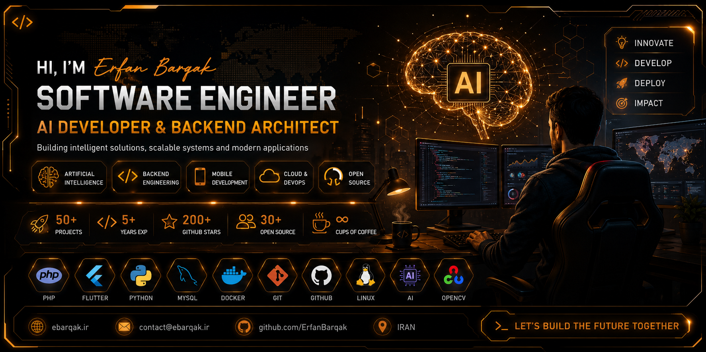

</div>

<br>

<h1 align="center">

Hi 👋 I'm <span style="color:#F5A623;">Erfan Barqak</span>

</h1>

<h3 align="center">

Full Stack Developer • AI Engineer • System Architect

</h3>

<p align="center">

Building Intelligent Software with Modern Technologies

</p>

---

<div align="center">

[](https://ebarqak.ir)

[](https://github.com/erfanbarghak)

[](mailto:you@example.com)

</div>

---

<div align="center">


</div>

---

## 🚀 About Me

```text
💡 Passionate about solving real-world problems with software.

🧠 Artificial Intelligence & Computer Vision Developer.

⚙️ Backend Architect using PHP & CodeIgniter.

📱 Flutter Cross Platform Developer.

☁️ Cloud, Docker & Linux Enthusiast.

❤️ Open Source Contributor.

🚀 Building scalable intelligent systems.
```

---

## ⚡ Current Focus

- 🤖 AI Powered Platforms
- 👁 Computer Vision
- 📱 Flutter Applications
- 🌐 Modern Backend APIs
- ⚙ CodeIgniter 4
- 🐳 Docker Infrastructure
- 🧠 Machine Learning
- ☁ Linux Servers

---

<div align="center">

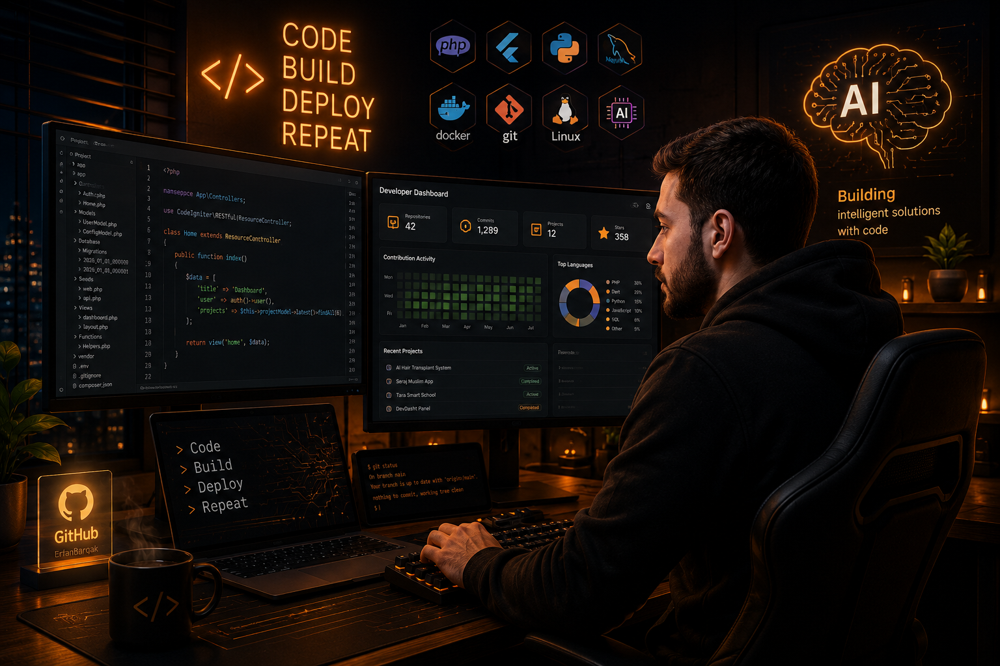

</div>

---

## 🌍 Portfolio

🌐 Website

https://ebarqak.ir

---

## 🧠 Personal Philosophy

> **"Technology should solve real problems, not create more complexity."**

---

## 🔥 Visitor Counter

<div align="center">


</div>

---

## ✨ Quick Facts

| | |
|:---|:---|
| 💼 Role | Full Stack Developer |
| 🤖 Speciality | Artificial Intelligence |
| ⚙ Backend | PHP / CodeIgniter |
| 📱 Mobile | Flutter |
| 🧠 AI | Computer Vision |
| 🐳 DevOps | Docker |
| 🐧 OS | Linux |
| 🌎 Website | ebarqak.ir |

---

<!-- ====================================================== -->
<!--                 SKILLS & TECH STACK                    -->
<!-- ====================================================== -->

# 💻 Tech Stack

<div align="center">


</div>

---

# ⚙️ Backend Development

<div align="center">

| Technology | Experience | Level |
|------------|-----------|-------|
| PHP | ████████████████ | ⭐⭐⭐⭐⭐ |
| CodeIgniter 4 | ████████████████ | ⭐⭐⭐⭐⭐ |
| REST API | ███████████████ | ⭐⭐⭐⭐⭐ |
| MySQL | ███████████████ | ⭐⭐⭐⭐⭐ |
| Authentication | █████████████ | ⭐⭐⭐⭐⭐ |
| JWT | ████████████ | ⭐⭐⭐⭐☆ |

</div>

---

# 📱 Mobile Development

<div align="center">

| Technology | Level |
|------------|-------|
| Flutter | ⭐⭐⭐⭐⭐ |
| Dart | ⭐⭐⭐⭐⭐ |
| Android | ⭐⭐⭐⭐☆ |
| Firebase | ⭐⭐⭐⭐☆ |

</div>

---

# 🤖 Artificial Intelligence

<div align="center">

| Field | Experience |
|-------|------------|
| Computer Vision | ⭐⭐⭐⭐⭐ |
| Image Processing | ⭐⭐⭐⭐⭐ |
| Deep Learning | ⭐⭐⭐⭐☆ |
| Machine Learning | ⭐⭐⭐⭐☆ |
| AI Automation | ⭐⭐⭐⭐⭐ |

</div>

---

# ☁ DevOps & Infrastructure

<div align="center">


</div>

<table>

<tr>

<td width="50%">

### 🐳 Docker

- Docker Containers
- Docker Compose
- Multi Service Deployment
- Container Optimization

</td>

<td width="50%">

### 🐧 Linux

- Ubuntu Server
- Shell Scripting
- Nginx
- VPS Management
- SSH

</td>

</tr>

</table>

---

# 🌐 Web Technologies

<div align="center">


</div>

- Responsive Design

- REST APIs

- Ajax

- JSON

- Progressive Web Apps

---

# 🧠 Areas of Expertise

<div align="center">

| 💡 | Specialization |
|----|----------------|
| 🤖 | Artificial Intelligence |
| 👁 | Computer Vision |
| ⚙ | Backend Architecture |
| 📱 | Cross Platform Apps |
| 🌍 | Web Applications |
| ☁ | Cloud Infrastructure |
| 🔒 | Authentication Systems |
| 🚀 | High Performance APIs |

</div>

---

# 🛠 Development Workflow

```text
Planning
      │
      ▼
System Design
      │
      ▼
Backend Development
      │
      ▼
AI Integration
      │
      ▼
Flutter Application
      │
      ▼
Testing
      │
      ▼
Docker Deployment
      │
      ▼
Production
```

---

# 🚀 Technologies I Love

<div align="center">

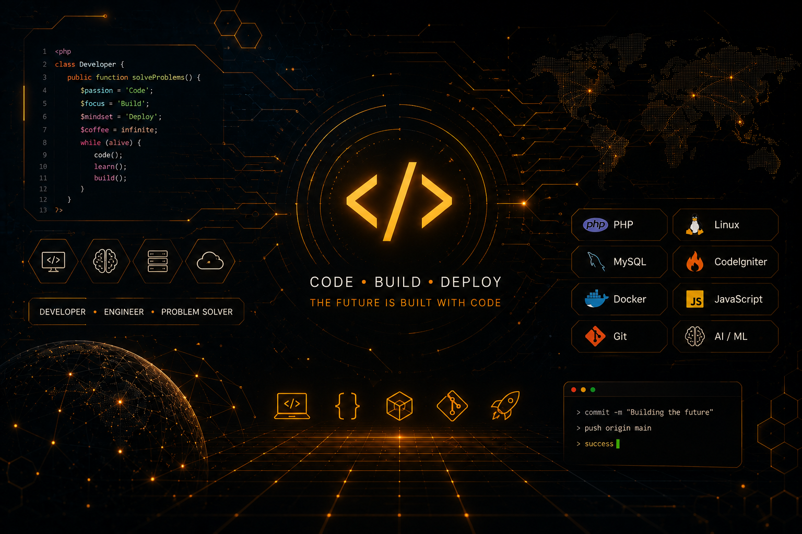

</div>

---

# 📊 Core Skills

```text
PHP               ███████████████████ 100%

CodeIgniter       ███████████████████ 100%

Flutter           █████████████████░░ 95%

Python            ████████████████░░░ 90%

Computer Vision   ████████████████░░░ 90%

AI                ███████████████░░░░ 85%

Docker            █████████████░░░░░░ 80%

Linux             █████████████░░░░░░ 80%

DevOps            ████████████░░░░░░░ 75%
```

---

# ⚡ Currently Learning

- Large Language Models (LLMs)

- AI Agents

- Retrieval-Augmented Generation (RAG)

- LangGraph

- MCP Protocol

- Kubernetes

- Microservices

---

<!-- ====================================================== -->
<!--                 FEATURED PROJECTS                      -->
<!-- ====================================================== -->

# 🚀 Featured Projects

<div align="center">

> **Building intelligent platforms, scalable backend systems and AI-powered applications.**

</div>

---

<table>

<tr>

<td width="50%">

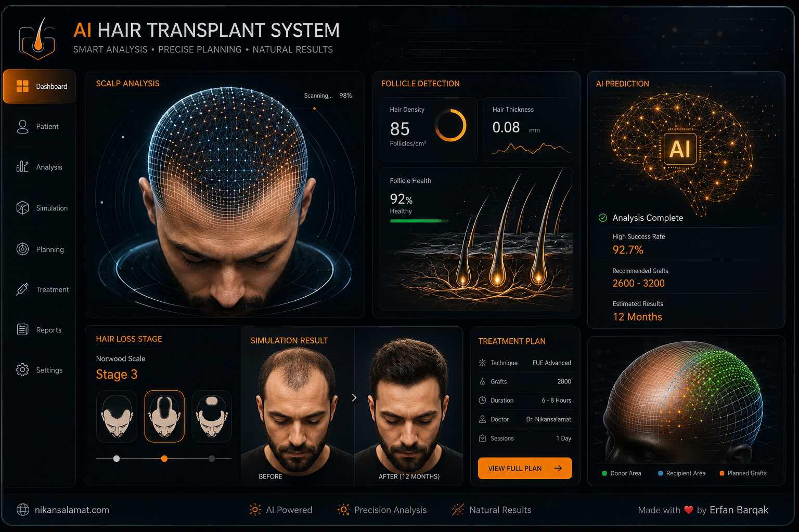

### 🤖 AI Hair Transplant System

Artificial Intelligence powered hair transplantation platform.

### Features

- Computer Vision
- Scalp Detection
- Follicle Analysis
- AI Recommendation
- REST API
- Dashboard
- Real Time Analytics

**Tech Stack**

PHP • CodeIgniter 4 • Python • AI • OpenCV

<a href="#">

</a>

</td>

<td width="50%">

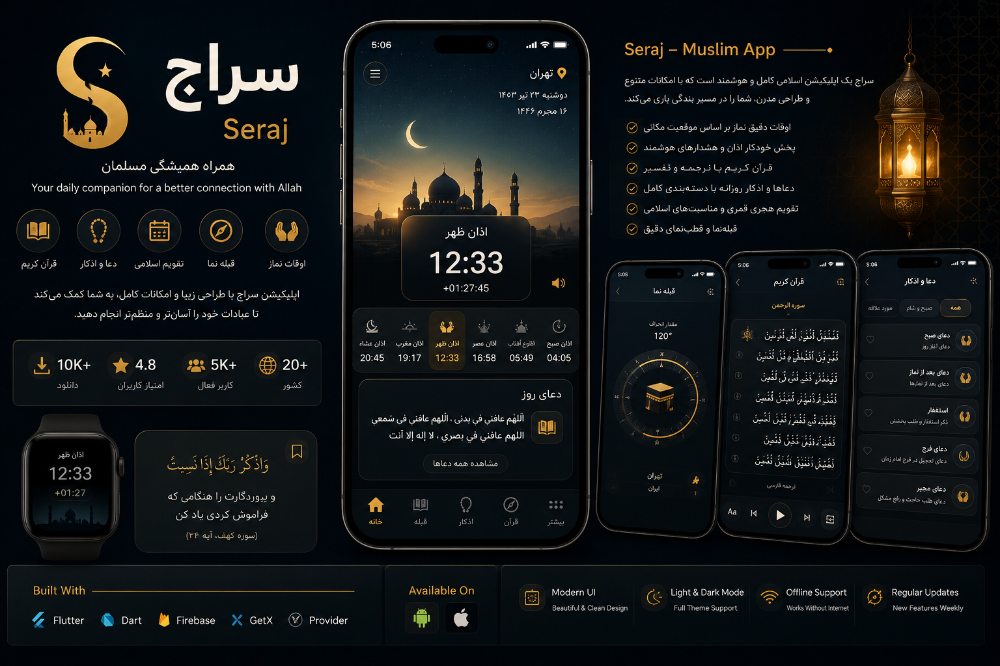

### 🌙 Seraj

Modern Islamic Super App.

### Features

- Prayer Times
- Quran
- Dua
- Azan
- Qibla
- Islamic Calendar
- Flutter App

**Tech Stack**

Flutter • Firebase • PHP API

<a href="#">

</a>

</td>

</tr>

</table>

---

<table>

<tr>

<td width="50%">

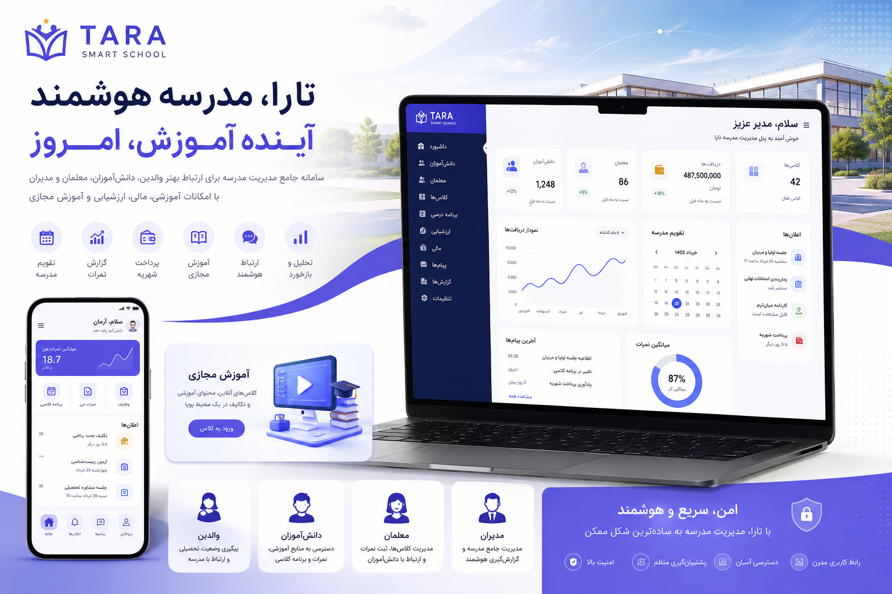

### 🏫 Tara Smart School

Complete Smart School Platform.

### Features

- Student Portal
- Parent Portal
- Teacher Dashboard
- Attendance
- Online Classes
- Tuition Management
- Reports

**Tech Stack**

CodeIgniter 4 • MySQL • Flutter

<a href="#">

</a>

</td>

<td width="50%">

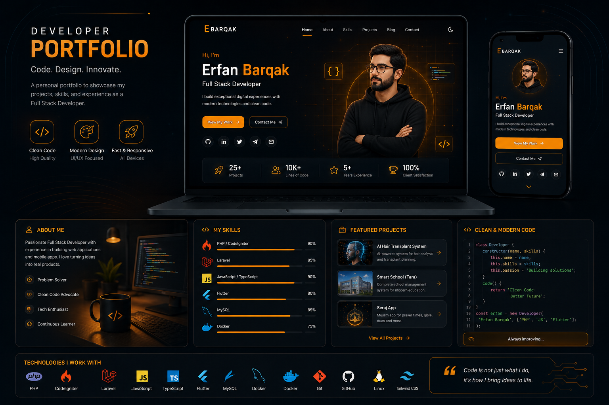

### 🌐 Personal Portfolio

Modern Portfolio Website.

### Features

- Responsive
- Dark Theme
- Blog
- Resume
- Contact
- GitHub Integration

**Tech Stack**

HTML • CSS • JavaScript • PHP

<a href="https://ebarqak.ir">


</a>

</td>

</tr>

</table>

---

# 🌟 Open Source Projects

<table>

<tr>

<td>

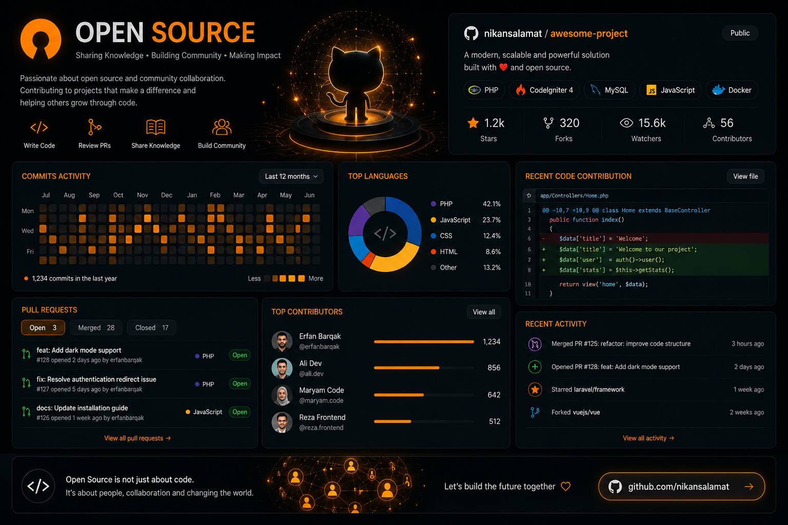

### 💻 Open Source

Sharing reusable solutions for developers.

- Packages

- APIs

- Flutter Components

- PHP Libraries

- AI Utilities

- GitHub Templates

</td>

<td>

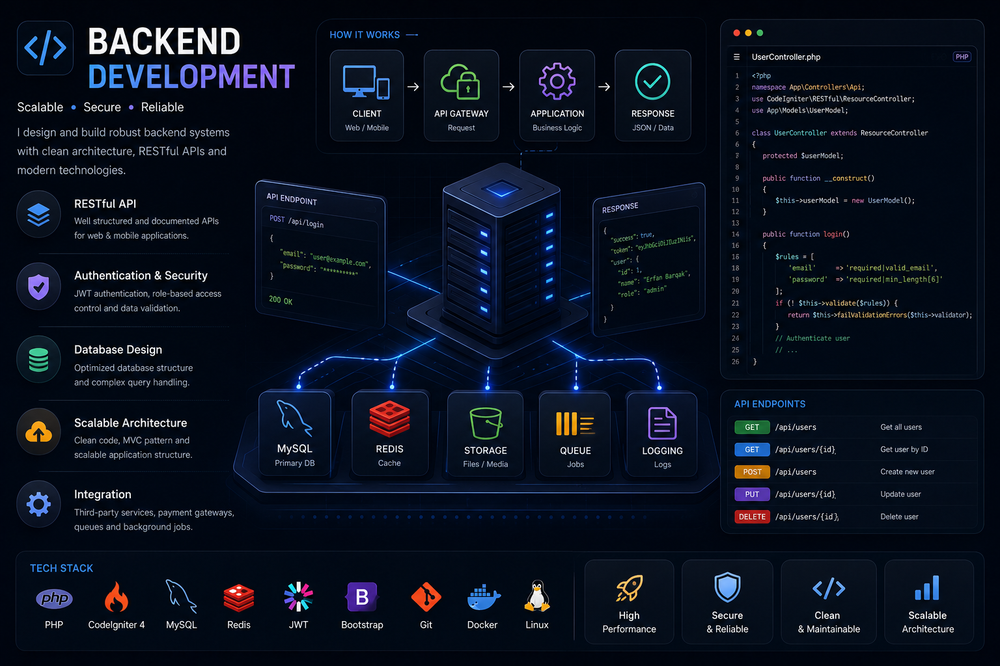

### ⚙ Backend Architecture

Scalable backend systems.

- REST APIs

- Authentication

- Docker

- Queue

- Cache

- Microservices

</td>

</tr>

</table>

---

# 📦 My Development Categories

<div align="center">

| Category | Projects |
|----------|----------|
| 🤖 Artificial Intelligence | 10+ |
| 🌐 Backend Systems | 30+ |
| 📱 Flutter Apps | 15+ |
| 💻 Web Applications | 40+ |
| ⚙ APIs | 25+ |
| 🔓 Open Source | Growing |

</div>

---

# 🔥 Favorite Technologies

<div align="center">


</div>

---

# 🚀 What I'm Building

```text
🤖 AI Platforms

⚙ Enterprise Backends

📱 Flutter Applications

🌐 Smart Web Platforms

☁ Cloud Infrastructure

🧠 Computer Vision Systems

📡 API Ecosystems

🚀 Open Source Libraries
```

---

# 📈 Development Goals

- Build AI products

- Create developer tools

- Contribute to Open Source

- Publish reusable packages

- Improve software architecture

- Learn cutting-edge technologies

---


<!-- ====================================================== -->
<!--           EXPERIENCE & SPECIALIZATIONS                 -->
<!-- ====================================================== -->

# 🚀 Experience

<div align="center">

> Designing modern software solutions with Artificial Intelligence, Backend Engineering and Mobile Development.

</div>

---

# 💼 Professional Areas

<table>

<tr>

<td width="33%">

## 🤖 Artificial Intelligence

✔ Computer Vision

✔ Image Processing

✔ Object Detection

✔ AI Automation

✔ OCR

✔ Machine Learning

</td>

<td width="33%">

## ⚙ Backend Engineering

✔ REST API

✔ Authentication

✔ CodeIgniter 4

✔ PHP

✔ MySQL

✔ MVC Architecture

</td>

<td width="33%">

## 📱 Mobile Development

✔ Flutter

✔ Android

✔ Firebase

✔ Push Notification

✔ Offline Storage

✔ REST Integration

</td>

</tr>

</table>

---

# 🌍 Services

<div align="center">

| Service | Description |
|---------|-------------|
| 🤖 AI Solutions | Intelligent software solutions |
| 🌐 Web Development | Modern web applications |
| 📱 Mobile Apps | Flutter Applications |
| ⚙ Backend APIs | High Performance APIs |
| ☁ Server Management | Linux & Docker |
| 🧠 Computer Vision | AI Image Processing |

</div>

---

# 🛠 Software Architecture

```text

                 Users
                    │
                    ▼
          Flutter / Web Client
                    │
                    ▼
             REST API Gateway
                    │
        ┌───────────┼───────────┐
        ▼           ▼           ▼
 Authentication   AI Engine   Dashboard
        │           │           │
        └───────────┼───────────┘
                    ▼
               MySQL Database
                    │
                    ▼
            Docker Infrastructure

```

---

# 🧩 Core Expertise

## 🔹 Backend

- Enterprise Applications

- Multi-user Systems

- API Design

- Authentication

- Admin Panels

- Payment Systems

---

## 🔹 Artificial Intelligence

- Computer Vision

- Medical AI

- Deep Learning

- Automation

- Object Detection

- Image Analysis

---

## 🔹 Mobile

- Flutter

- Android

- Cross Platform

- Firebase

- Local Database

- API Integration

---

# 🚀 Development Process

```text

Requirement Analysis

↓

Architecture Design

↓

UI / UX

↓

Backend Development

↓

API Integration

↓

AI Integration

↓

Testing

↓

Docker Deployment

↓

Production

```

---

# 🎯 Industries

- 🏥 Healthcare

- 🎓 Education

- 🕌 Religious Applications

- 🛒 E-Commerce

- 🏢 Enterprise Systems

- 🤖 Artificial Intelligence

---

# 💡 Technologies I Use Daily

<div align="center">


</div>

---

# 🌟 Principles

✔ Clean Code

✔ Scalable Architecture

✔ Security First

✔ Performance Optimization

✔ User Experience

✔ Open Source

✔ Continuous Learning

✔ Problem Solving

---

# 📌 Current Interests

- AI Agents

- Large Language Models

- Computer Vision

- Medical AI

- Smart School Systems

- Flutter Ecosystem

- Enterprise Backend

- Cloud Infrastructure


<!-- ====================================================== -->
<!--              GITHUB DASHBOARD                          -->
<!-- ====================================================== -->

---

# 🔥 GitHub Streak

<div align="center">


</div>

---

# 🏆 GitHub Trophy

<div align="center">


</div>

---

# 📈 Contribution Graph

<div align="center">


</div>


---

# 🧠 Coding Distribution

```text
PHP                 ████████████████████   38%

Flutter             ████████████████       26%

Python              ███████████            15%

JavaScript          ████████               10%

SQL                 █████                  6%

Shell               ███                    3%

Other               ██                     2%
```

---

# ⚡ Current Development

| Project | Progress |
|---------|----------|
| 🤖 AI Hair Transplant | ██████████░░ 80% |
| 🕌 Seraj App | ████████░░░░ 65% |
| 🏫 Tara School | ███████████░ 90% |
| 🌐 Portfolio | ████████████ 100% |

---

# 🚀 Coding Environment

```text
OS          Ubuntu Linux

Editor      VS Code

Terminal    Bash

Backend     PHP / CodeIgniter

Frontend    HTML CSS JS

Mobile      Flutter

Database    MySQL

Container   Docker

Version     Git

Hosting     Linux VPS
```

---

# 📦 Development Workflow

```text
IDE

↓

Git

↓

GitHub

↓

Testing

↓

Docker

↓

Production

↓

Monitoring
```

---

# 📊 Repository Insights

<div align="center">

| Type | Count |
|------|-------|
| Backend Projects | 🚀 Growing |
| Flutter Apps | 🚀 Growing |
| AI Projects | 🚀 Growing |
| APIs | 🚀 Growing |
| Open Source | 🚀 Growing |

</div>

---

# 🎯 Goals

- 🚀 100+ Public Repositories

- ⭐ 1000+ Stars

- 🤝 Open Source Contributions

- 📚 Publish Packages

- 🧠 AI Research

- 📱 Flutter Packages

- 🌐 Modern APIs

---


<!-- ====================================================== -->
<!--              DEVELOPER JOURNEY                         -->
<!-- ====================================================== -->


# 🚀 Mission

> **Building intelligent software that solves real-world problems through innovation, simplicity, and Artificial Intelligence.**

---

# 🌍 Vision

I believe software should not only be functional,
it should be intelligent, scalable, beautiful and meaningful.

Every project I build aims to improve people's lives through
modern technologies, Artificial Intelligence and clean architecture.

---

# 💡 What Drives Me

<table>

<tr>

<td width="33%" align="center">


### Innovation

Building new ideas using
Artificial Intelligence.

</td>

<td width="33%" align="center">


### Engineering

Writing scalable,
clean and maintainable code.

</td>

<td width="33%" align="center">


### Impact

Creating software that
helps thousands of people.

</td>

</tr>

</table>

---

# 📖 My Development Philosophy

```text

Learn

↓

Think

↓

Design

↓

Prototype

↓

Develop

↓

Test

↓

Deploy

↓

Optimize

↓

Repeat

```

---

# 🧠 Areas I Enjoy

✅ Artificial Intelligence

✅ Computer Vision

✅ Backend Engineering

✅ Flutter Development

✅ Enterprise Software

✅ Medical Technologies

✅ Automation

✅ Open Source

---

# ⚙ Daily Workflow

```text

Coffee ☕

↓

Planning

↓

Coding

↓

Debugging

↓

Git Commit

↓

Docker

↓

Deploy

↓

Learning

↓

Sleep 😴

Repeat...

```

---

# 📅 My Weekly Routine

| Day | Focus |
|------|-------|
| Monday | Backend |
| Tuesday | Flutter |
| Wednesday | AI |
| Thursday | APIs |
| Friday | Open Source |
| Saturday | Learning |
| Sunday | Research |

---

# 📚 Favorite Topics

- Artificial Intelligence

- Machine Learning

- Computer Vision

- Software Architecture

- Clean Code

- System Design

- Docker

- Linux

- Flutter

- REST APIs

---

# 🎯 Long-Term Goals

✅ Build AI Products

✅ Launch SaaS Platforms

✅ Publish Open Source Libraries

✅ Create Developer Tools

✅ Help Startups Build Better Software

✅ Build Healthcare Solutions

✅ Teach Programming

✅ Contribute to Open Source

---

# 🏗 Current Architecture

```text

                   Cloud

                     │

          ┌──────────┴──────────┐

          │                     │

      REST API             Flutter App

          │                     │

          └──────────┬──────────┘

                     │

             AI Processing

                     │

                MySQL Database

                     │

                  Docker

                     │

                Linux Server

```

---

# ❤️ Things I Love

🐧 Linux

⚙ Docker

💙 Flutter

🐘 PHP

🤖 Artificial Intelligence

👁 Computer Vision

☁ Cloud Computing

📖 Learning

☕

Coffee

---

# 🌟 Personal Values

✔ Curiosity

✔ Creativity

✔ Simplicity

✔ Responsibility

✔ Teamwork

✔ Continuous Learning

✔ Quality

✔ Open Source

---

# 📈 My Roadmap

```text

2024

██████████████

Backend

Flutter

AI

↓

2025

██████████████████████

Enterprise Systems

Computer Vision

Cloud

↓

2026

████████████████████████████

AI Platforms

Medical AI

Open Source

↓

Future

██████████████████████████████████

Global Products

SaaS

Research

Innovation

```

---

# 🧩 Fun Facts

💻 I enjoy solving complex software problems.

🤖 AI is my favorite field.

🚀 I love building scalable backend systems.

☁ Linux is my daily environment.

📱 Flutter makes mobile development enjoyable.

---

<div align="center">

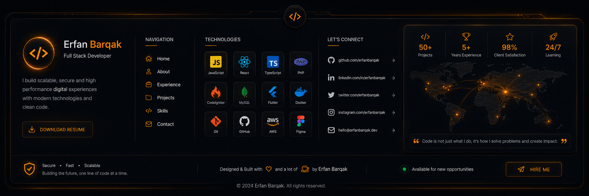

</div>

---


<!-- ====================================================== -->
<!--               CONTACT & CONNECT                        -->
<!-- ====================================================== -->

# 🤝 Let's Connect

<div align="center">

> **I'm always interested in collaborating on innovative projects, AI solutions, and open-source initiatives.**

</div>

---

# 🌍 Find Me Around the Web

<div align="center">

<a href="https://ebarqak.ir">

</a>

<a href="https://github.com/erfanbarghak">

</a>

<a href="mailto:barerf1232@gmail.com">

</a>

</div>

---

# 💼 Professional Profiles

| Platform | Purpose |
|----------|---------|
| 🌐 Personal Website | Portfolio & Projects |
| 💻 GitHub | Open Source & Code |
| 💼 LinkedIn | Professional Network |
| 📝 Blog | Technical Articles |
| 📄 Resume | Experience & Skills |

---

# 📄 Download My Resume

<div align="center">

<a href="assets/resume.pdf">


</a>

</div>

---

# 🤝 Collaboration

I'm open to collaborating on projects related to:

- 🤖 Artificial Intelligence
- 🧠 Computer Vision
- 🌐 Full Stack Development
- ⚙ Backend Architecture
- 📱 Flutter Applications
- ☁ Cloud Infrastructure
- 🏥 Healthcare Technology
- 🎓 Educational Platforms

---

# 📬 Contact

```text
🌍 Website  : https://ebarqak.ir

💻 GitHub   : github.com/erfanbarghak

📧 Email    : barerf1232@gmail.com

📍 Location : Available for Remote Collaboration
```

---

# 💙 Support My Work

If you enjoy my projects and find them useful:

⭐ Star my repositories

🍴 Fork interesting projects

🐞 Report issues

💡 Suggest improvements

🤝 Contribute to open source

Share my work with others

---

# 📚 Latest Articles

| Article | Status |
|---------|--------|
| AI Engineering | Coming Soon |
| Flutter Tips | Coming Soon |
| Backend Architecture | Coming Soon |
| Docker Guide | Coming Soon |
| Computer Vision | Coming Soon |

---

# 📅 2026 Focus

```text
✔ Artificial Intelligence

✔ Healthcare Systems

✔ Smart School Platform

✔ Flutter Ecosystem

✔ Enterprise Backend

✔ Open Source

✔ SaaS Platforms

✔ Cloud Infrastructure
```

---

# 💬 Favorite Quote

> **"Great software is built by solving real problems, not by writing more code."**

---

# ❤️ Thanks for Visiting

<div align="center">

If you like my work,

consider following me and starring my repositories.

It motivates me to build more open-source projects.

⭐ 🚀 ❤️

</div>

---

<div align="center">

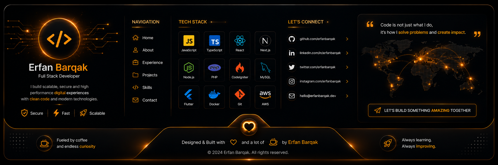

</div>

---

<div align="center">

### Made with ❤️, ☕, PHP, Flutter and Artificial Intelligence


</div>

<!-- ====================================================== -->
<!--                    END README                          -->
<!-- ====================================================== -->

